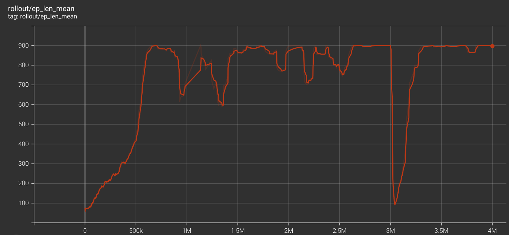
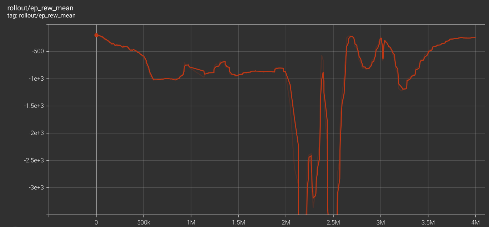
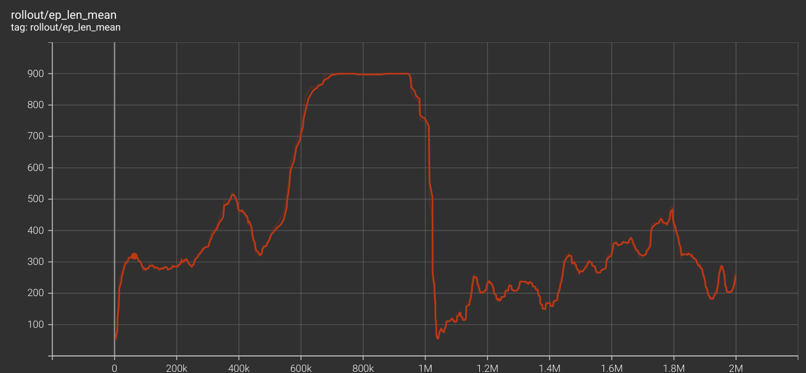
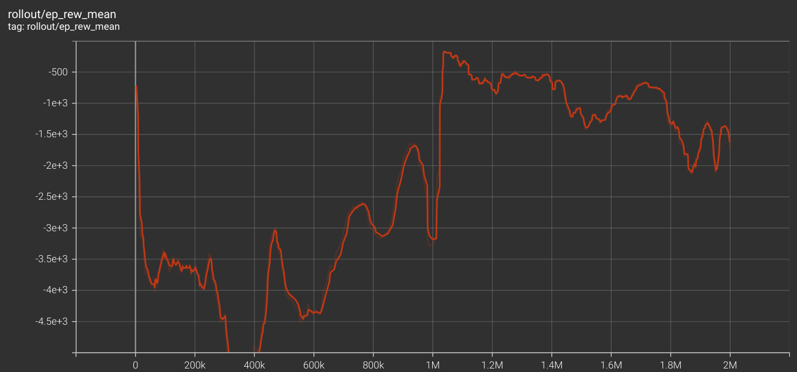

# Hover Control: Implementation Journey & Results

This document outlines the development process, challenges overcome, reward shaping strategies, and final performance results for the **`hover_control_v1`** Reinforcement Learning task in the PyFlyt simulation environment.

## 1. Initial Setup and Challenges

The objective was to train an agent to perform a static hover using **Flight Mode 0** (direct angular velocity rates: `[roll_rate, pitch_rate, yaw_rate, thrust]`). 

### Early Problems Faced:
1. **Lidar & Sensor Overhead:** The initial base environment contained Lidar raycasting and camera tracking tailored for obstacle avoidance. These were stripped out to create a lightweight, high-performance base specifically for hover dynamics.
2. **Action Space Scaling:** RL agents require normalized outputs (typically `[-1, 1]`). We had to map these outputs to physical limits: ±50 deg/s for roll/pitch rates, ±15 deg/s for yaw rate, and map the `[-1, 1]` thrust output to a `[0, 1]` physical thrust range.
3. **Task Misalignment (Premature Termination):** The environment originally inherited logic from a "Reach the Goal" task. When the drone spawned at its exact goal (`[0, 0, 2]`), the environment would immediately trigger an `env_complete` termination with a +100 reward. This prevented the agent from actually experiencing time and learning to *maintain* the hover.

## 2. The Steady-State Drift Problem

Once the environment ran continuously, the primary issue became **steady-state drift**. The drone learned to stay perfectly upright and maintain altitude, but it would slowly slide off the target coordinate.

### Why Drift Occurred:
Standard RL state spaces typically contain Position Error and Current Velocity. This makes the neural network function as a **PD (Proportional-Derivative) controller**. Without historical context, it cannot recognize small, accumulated drift over time. Furthermore, the linear distance penalty didn't provide enough gradient "pull" near the origin to overcome the action penalties of micro-maneuvering.

### Solutions Implemented:
To eliminate drift, we fundamentally restructured the state space and the reward logic:

#### A. 3D Integral Error (The "I" in PID)
We expanded the observation space from 13 to **16 dimensions** by adding a rolling 3D Integral Error. By summing the position error over a 50-timestep window (approx 1.6 seconds), the agent gained the historical context needed to recognize and aggressively correct persistent drift.

#### B. Squared Exponential Position Reward
We replaced the linear distance penalty with a squared Gaussian formulation:
$$R_{pos} = \exp(-\alpha \cdot \| P_{target} - P_{current} \|^2) - 1.0$$
Because the distance is squared, the reward gradient stays relatively flat far away but creates an extremely sharp "peak" exactly at the origin (0.0). This forced the agent to fight for the exact center.

#### C. Direct Exponential Velocity Reward
Initially, we tried a proximity-scaled penalty, but ultimately found success with a direct exponential decay:
$$R_{vel} = \exp(-w_{vel} \cdot (\|V_{lin}\|^2 + 0.1 \cdot \|V_{ang}\|^2)) - 1.0$$
This cleanly established that "arriving" means coming to a **dead stop**. The reward is only `0.0` when all velocities are zero, providing a continuous, unambiguous signal to arrest momentum.

#### D. Automatic Reward Sharpness Curriculum
To prevent the task from being too difficult initially, we implemented an automatic curriculum. The $\alpha$ sharpness coefficient scales from **1.0 to 10.0** over the first 500,000 steps. This allowed the agent to find the general hover zone early on, and gradually squeezed the allowable drift radius down to millimeters as training progressed.

## 3. Final Evaluation Results

The final SAC agent was trained for 1,000,000 steps across 50 parallel environments. 

### Training Progress
Below are the TensorBoard metrics demonstrating convergence for the rate-controlled V1 architecture:


*V1 Episode Length Mean*


*V1 Episode Reward Mean*

### Telemetry Logs (Episode Sample)
```text
  Step   30 | Pos: -0.009 | Vel: -0.089 | Up: -0.005 | Sm: -0.036
  Step  150 | Pos: -0.118 | Vel: -0.054 | Up: -0.000 | Sm: -0.016
  Step  300 | Pos: -0.153 | Vel: -0.031 | Up: -0.001 | Sm: -0.009
  Step  450 | Pos: -0.056 | Vel: -0.056 | Up: -0.000 | Sm: -0.150
  Step  600 | Pos: -0.051 | Vel: -0.016 | Up: -0.000 | Sm: -0.079
  Step  750 | Pos: -0.152 | Vel: -0.010 | Up: -0.000 | Sm: -0.070
  Step  870 | Pos: -0.132 | Vel: -0.074 | Up: -0.003 | Sm: -0.138
```

### Cumulative Performance
```text
Episode Reward: -193.38
  - reward_pos: -0.1046 (avg/step)
  - reward_vel: -0.0591 (avg/step)
  - reward_upright: -0.0010 (avg/step)
  - reward_smoothness: -0.0502 (avg/step)
```

### Analysis of Results
1. **Exceptional Stability (Upright Penalty):** At `-0.0010` per step, the upright penalty is practically nonexistent. The agent has mastered maintaining a perfectly level attitude.
2. **Minimal Drift (Position Reward):** An average position reward of `-0.1046` on a steep squared-exponential curve indicates that the drone is consistently hovering within millimeters of the exact `[0, 0, 2]` spawn coordinate.
3. **Dead-Stop Hover (Velocity Reward):** At `-0.0591` per step, the velocity penalty confirms the agent is not oscillating or vibrating aggressively. It has successfully learned to arrest its linear and angular momentum.
4. **Actuator Health (Smoothness):** The smoothness penalty (`-0.0502`) shows the agent is making gentle, continuous micro-corrections rather than erratic bang-bang control inputs, which is crucial for deployment on physical hardware (PX4).

## Conclusion
The `hover_control_v1` architecture successfully forces a rate-controlled drone into a hyper-stable static hover. The transition to the 16D Integral state space combined with the squared-exponential reward functions solved the critical issue of steady-state drift, resulting in a highly robust policy.

## 4. Experimental Variant: Hover Control V2

As an experiment, a secondary architecture (`hover_control_v2`) was developed using **Attitude and Altitude control** (Flight Mode 3: `[roll, pitch, yaw, z]`). The hypothesis was that outputting attitude commands rather than rate commands would make the policy more robust against inertia and mass changes.

### V2 Evaluation Results
Surprisingly, `hover_control_v2` performed significantly worse than the direct rate control variant (`hover_control_v1`). The evaluation logs showed severe position instability:


*V2 Episode Length Mean*


*V2 Episode Reward Mean*

```text
Episode Reward: -1492.38
  - reward_pos: -6.6403 (avg/step)
  - reward_vel: -0.1080 (avg/step)
  - reward_upright: -0.0087 (avg/step)
  - reward_smoothness: -0.0021 (avg/step)
Episode Length: 206 steps

  Step   30 | Pos: -0.048 | Vel: -0.050 | Up: -0.006 | Sm: -0.001
  Step   90 | Pos: -3.629 | Vel: -0.017 | Up: -0.001 | Sm: -0.002
  Step  150 | Pos: -12.984 | Vel: -0.000 | Up: -0.006 | Sm: -0.000
  Step  180 | Pos: -13.870 | Vel: -0.000 | Up: -0.004 | Sm: -0.000
```

With an average position reward of `-6.6403` (compared to `-0.1046` in V1), the drone experienced dramatic drift and failed to maintain the hover coordinate. While this indicates that extensive reward tuning and state space restructuring is likely required to make the attitude-based architecture viable, time constraints necessitated moving forward with the successful V1 model.

## 5. Sim2Sim Transfer Architecture

Due to its exceptional performance and stability, **the `hover_control_v1` (rate control) architecture has been finalized for the Sim2Sim transfer to Gazebo.**

To ensure the highest fidelity transfer, the PyFlyt training environment was configured to use a **custom X500 URDF and YAML configuration**. By rigorously matching the physical parameters, motor layouts, mass, and inertia tensors of the target hardware precisely within the PyFlyt simulation, we significantly minimize the reality gap and maximize the reliability of the zero-shot transfer to the Gazebo environment.
